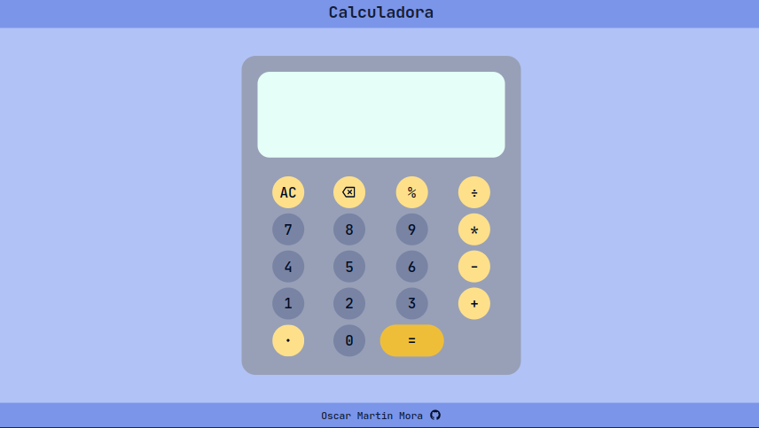

# Calculator

**Calculator** es una pagina web que recrea las operaciones de una calculadora básica.

Este proyecto forma parte del plan de estudio de [The Odin Project](https://www.theodinproject.com/lessons/foundations-calculator) y se puede acceder a una demo haciendo click [¡aquí!](https://moramartin99.github.io/Calculator/).



## Características

Calculator puede realizar las siguientes operaciones:

-   Suma
-   Resta
-   Multiplicación
-   División
-   Operaciones con números positivos y negativos
-   Operaciones con números enteros y decimales
-   Operaciones con porcentajes
-   Encadenamiento de operaciones

Calculator trabaja hasta un limite de **10 cifras por operando**. En el caso de los enteros trabaja de _-9999999999_ a _9999999999_, mientras que en el caso de los decimales, la precisión se establece de forma dinámica considerando primero cuantos dígitos tiene la parte entera y calculando la cantidad maxima de decimales posible para obtener un operando de 10 dígitos, por ejemplo:

```
Para un número con 2 dígitos en su parte entera, se podrá tener hasta 8 dígitos en su parte decimal y de esta manera completar un operando de hasta 10 dígitos como máximo:

-   -10.03 es valido
-   98.11111111 es valido
-   0.1234567891 no es valido por que tiene un total de 11 dígitos
```

Calculator puede tomar como inputs validos tanto clicks en la interfaz gráfica como el uso del teclado.
